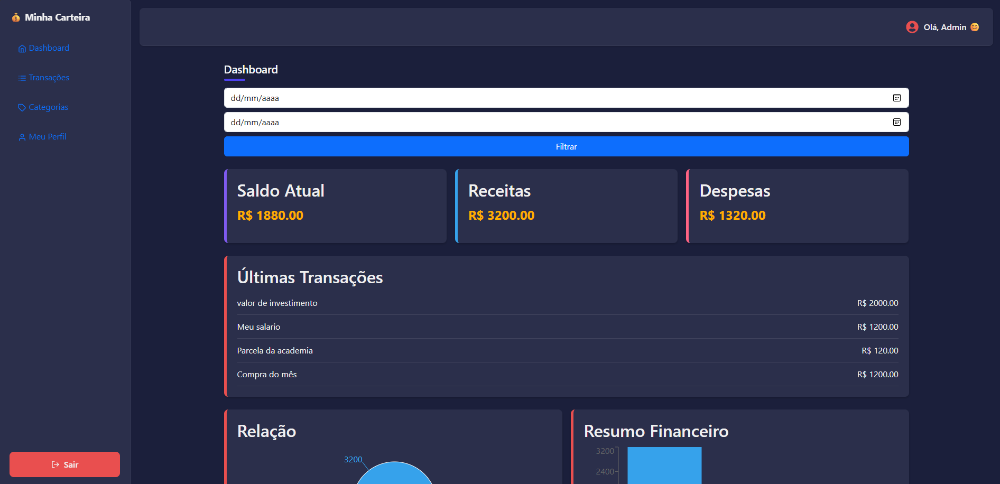
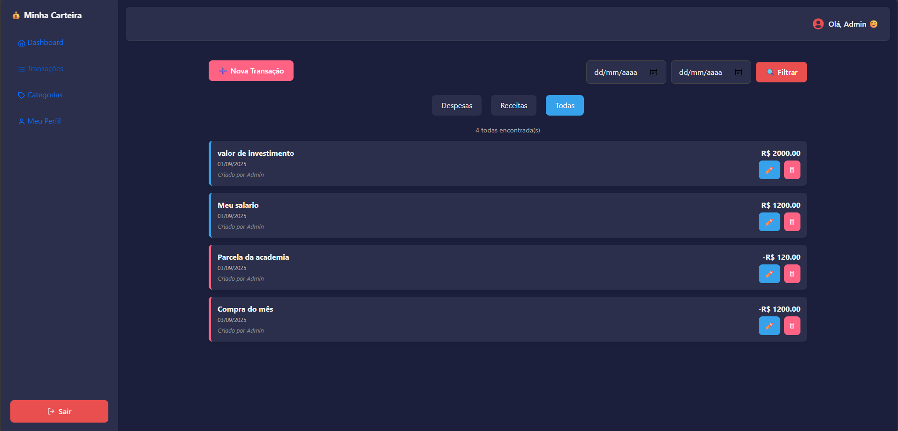
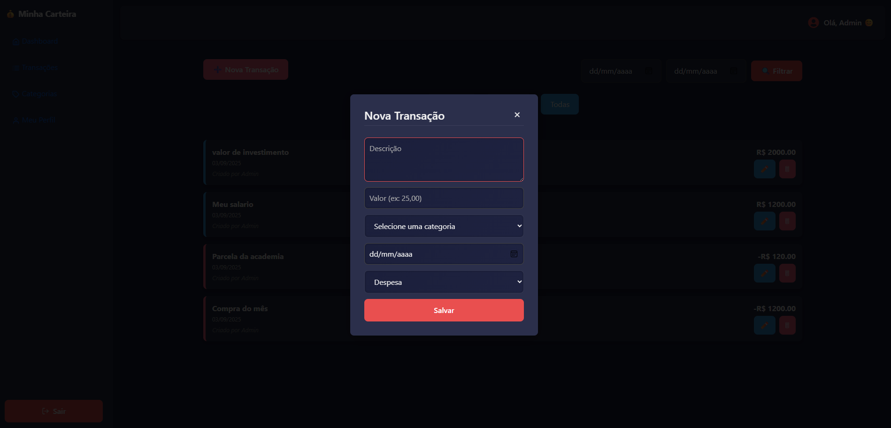
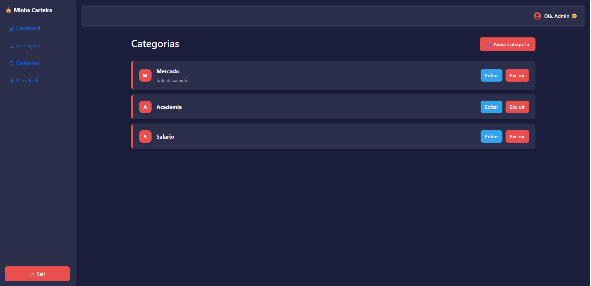
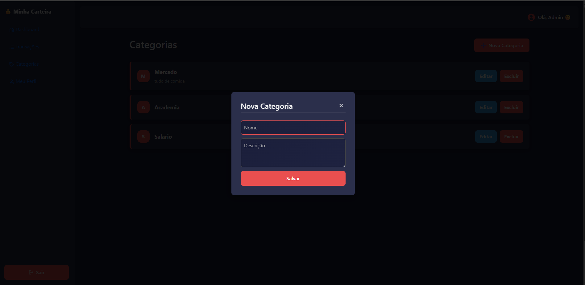

# 💸 Sistema Financeiro - Frontend

Frontend do sistema financeiro pessoal desenvolvido com **React**, voltado para controle de receitas, despesas, saldo e relatórios. Totalmente responsivo, com suporte a **PWA (Progressive Web App)** para uso em dispositivos móveis Android e iOS.

---

## 🖼️ Imagens do Sistema

> Coloque suas imagens na pasta `/public/images/` e atualize os caminhos abaixo:

### 🔐 Tela de Login


### 📊 Dashboard Principal



### 💰 Lista de Transações



### 💰 Nova Transação




### 💰 Lista de Categorias



### 💰 Nova Transação




---

## 🚀 Instalação e Execução

```bash
# Clonar o repositório
git clone https://github.com/seuusuario/seu-repo-front.git

# Entrar na pasta
cd seu-repo-front

# Instalar as dependências
npm install

# Iniciar o servidor de desenvolvimento
npm run dev
